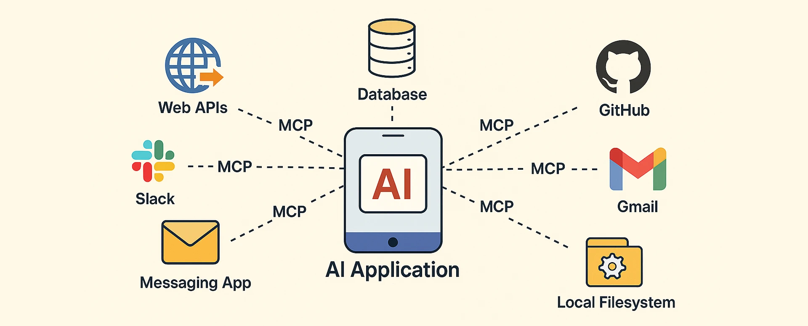

# 🌐 MCP Ecosystem

Welcome to the **MCP Ecosystem** — a centralized index gathering a suite of projects centered around the **Model Context Protocol (MCP)**, an open standard for connecting AI applications with external data sources and tools.

## 📑 Table of Contents

- [Ecosystem Overview](#ecosystem-overview)
- [Featured Repositories](#featured-repositories)
- [What is MCP?](#what-is-mcp)
- [Core Concepts](#core-concepts)
- [How MCP Works](#how-mcp-works)
- [Key Benefits](#key-benefits)

## 🧭 Ecosystem Overview

The **MCP Ecosystem** acts as your one-stop hub for all things related to the Model Context Protocol. Whether you're building custom AI agents, deploying MCP servers, or testing new integrations, this collection streamlines development and fosters interoperability.

**Features:**
- 🚀 Curated set of repositories: client libraries, authentication systems, server implementations, and integration templates.
- 🔒 Focus on security, extensibility, and MCP compliance.
- 📚 Comprehensive documentation and active community support.

> Ideal for bridging the gap between powerful AI models and the complex world of real data and services — enabling **scalable**, **secure**, and **future-proof** integrations!

## 📦 Featured Repositories

### [`mcp-llm-client`](https://github.com/rb58853/mcp-llm-client) 🐍
Python client for connecting to MCP servers via multiple protocols, designed for LLM integration.
- Modular, extensible architecture.
- Supports HTTPStream and GPT-4 mini out of the box.
- Intuitive configuration and easy to extend for new protocols and models.

---

### [`mcp-oauth`](https://github.com/rb58853/mcp-oauth) 🔑
A simple yet extensible OAuth system in Python for MCP flows.
- Implements both OAuth server and client, integrating with `FastMCP`.
- Based on the authentication system in the [official MCP SDK](https://github.com/modelcontextprotocol/python-sdk/tree/main/examples).
- Emphasis on standardization and practical usage via pip package.

---

### [`supabase-mcp-server`](https://github.com/rb58853/supabase-mcp-server) 🛡️
Extends [supabase-mcp-server](https://github.com/alexander-zuev/supabase-mcp-server) with:
- OAuth2-based authentication & authorization.
- Streamable HTTP transport protocol.
- Compatibility with Docker-based, self-hosted Supabase servers.

---

### [`simple-mcp-server`](https://github.com/rb58853/simple-mcp-server) ⚡
A lightweight Python MCP server built using `fastmcp` and `fastapi`.
- Reference implementation for learning and experimentation.
- Great for testing client/server interactions and FastAPI-based HTTPStreaming.

---

### [`template_mcp_llm_client`](https://github.com/rb58853/template_mcp_llm_client) 🧪
Minimal template for validating and testing [`mcp-llm-client`](https://github.com/rb58853/mcp-llm-client).
- Quick client integration checks.
- Useful for reproducible feature validation or starting new integrations.

## ❓ What is MCP?

The **Model Context Protocol (MCP)** is an open, universal protocol **standardizing how LLMs and AI agents interact with external data sources, tools, and services in real time**. MCP empowers AI models to break free from isolation, allowing dynamic access to live information and the ability to execute real-world actions.

### 🧩 Why MCP?
Before MCP, each AI system needed custom, often redundant, integrations with every data source or tool — leading to complexity and maintenance headaches. MCP acts as a **universal standard**, similar to how USB unified device connectivity.

#### Main Capabilities

- **Resources** 📄: GET-like endpoints providing structured data (databases, APIs, documents).
- **Tools** 🛠️: POST-like endpoints that execute actions or side effects (e.g., sending emails, running scripts).
- **Prompts** 🗨️: Reusable templates for consistent model interaction patterns.

### 🏛️ How MCP Works

**Client-Server Architecture:**

- **MCP Hosts**: Applications/interfaces using AI models seeking external data.
- **MCP Clients**: Middleware maintaining communications with MCP servers.
- **MCP Servers**: Services exposing resources, tools, and prompts via the MCP protocol.
- **Data Sources/Remote Services**: Databases, files, APIs, or services that MCP servers interact with.

By introducing a common abstraction layer, **MCP shifts the integration challenge from M×N (each client to each service)** to **M+N (via a shared standard)**.

### 🌟 Key Benefits

- **Simplified Integration**: One standard, many possibilities.
- **Interoperability**: Any MCP client ↔ any MCP server.
- **Real-Time Access**: Models fetch the latest, most relevant data instantly.
- **Easy Scaling & Maintenance**: Standardized protocol facilitates expansion and updates.
- **Security & Control**: Organizations integrate private data with secure, policy-driven access.

---

**Explore, build, and connect — unlock the future of AI integrations with MCP!** 🚀
